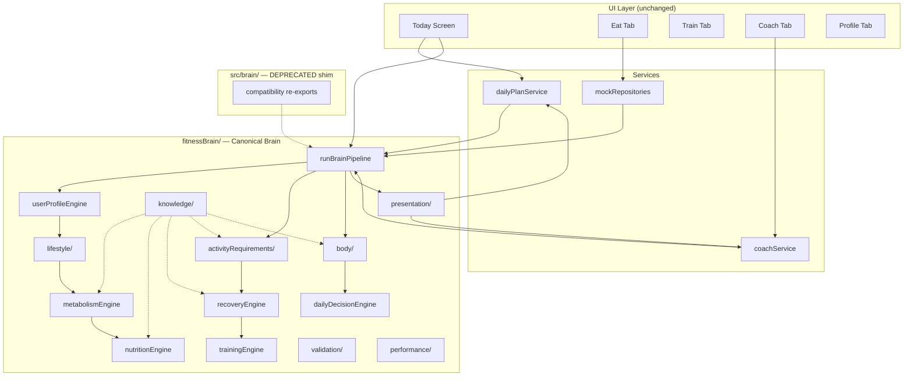

# FitnessAI Architecture Stabilization Report

**Date:** July 2026  
**Scope:** Architecture review and stabilization (no UI/UX changes, no new features)

---

## Executive Summary

FitnessAI now has **one canonical Brain** at `src/fitnessBrain/`. The legacy `src/brain/` directory is deprecated and retained only as a thin compatibility shim. All production services (`dailyPlanService`, `coachService`, mock repositories) route through the canonical pipeline and presentation adapters.

---

## Priority 1 — Single Brain Architecture

### Before
- **`src/brain/`** — legacy rule engine powering Daily Plan, Coach, mock meal macros
- **`src/fitnessBrain/`** — newer engine powering Today Smart Focus, activity logging, lifestyle

Both systems ran in parallel; Today used both hooks.

### After
| Concern | Canonical location |
|---------|-------------------|
| Today / Eat / Train / Coach / Profile | `fitnessBrain/pipeline` + `fitnessBrain/presentation` |
| Future AI / Backend / Wearables | `fitnessBrain/` (single entry via `runBrainPipeline`) |
| Daily Plan UI shape | `presentation/dailyPlanAdapter.ts` |
| Coach insights UI shape | `presentation/coachInsightsAdapter.ts` |
| Food portion math | `foodKnowledge/computePortionFromFoodId` |

### Migrated from legacy brain
- Exercise catalog → `fitnessBrain/knowledge/exercises/catalog.ts`
- Food portion computation → `fitnessBrain/foodKnowledge`
- Daily plan composition → `fitnessBrain/presentation/dailyPlanAdapter.ts`
- Coach recommendations → `fitnessBrain/presentation/coachInsightsAdapter.ts`

### Deprecated
- `src/brain/` — shim re-exports canonical brain; **safe to delete when zero imports remain**

---

## Priority 2 — Duplicate Logic Removed

| Area | Change |
|------|--------|
| Activity multipliers / BMR offsets | Moved to `knowledge/metabolismRules.ts`; `metabolismEngine.ts` consumes knowledge only |
| Activity requirement thresholds | Centralized in `knowledge/activityRequirementValues.ts` |
| Activity recovery penalties | Moved to `knowledge/recoveryRules.ts` (`RECOVERY_VALUES`) |
| Fueling / recovery engines | `activityFuelingEngine.ts`, `activityRecoveryEngine.ts` now import knowledge constants |
| Exercise catalog | Single copy in `fitnessBrain/knowledge/exercises/` |

---

## Priority 3 — Knowledge Separation

Scientific thresholds now live in the Knowledge layer:

| Module | Owns |
|--------|------|
| `knowledge/nutritionRules.ts` | Protein, water, fiber, calorie bands |
| `knowledge/metabolismRules.ts` | Mifflin offsets, activity multipliers |
| `knowledge/recoveryRules.ts` | Recovery scoring, activity penalties |
| `knowledge/trainingRules.ts` | Session templates, training days |
| `knowledge/activityRequirementValues.ts` | Duration, energy load, hydration-heavy IDs |
| `body/bodyKnowledge.ts` | Body-state bands (energy, hydration, stress, age) |

Engines execute rules; they no longer embed duplicate constants.

---

## Priority 4 — Body Engine Foundation

New hidden module: `fitnessBrain/body/`

```
body/
├── bodyState.ts      — unified BodyState types
├── bodySignals.ts    — collects cross-domain signals
├── bodyEngine.ts     — computes BodyState from signals
├── bodyKnowledge.ts  — scientific thresholds for body interpretation
└── index.ts
```

`BodyState` is included in `FitnessBrainState` and `DecisionContext`. Engines will gradually depend on body state instead of re-implementing physiology inline.

---

## Priority 5 — Official Brain Pipeline

**Entry point:** `runBrainPipeline()` in `fitnessBrain/pipeline/brainPipeline.ts`

### Execution order

```
Profile
    ↓
Lifestyle
    ↓
Metabolism
    ↓
Nutrition
    ↓
Activity Requirements
    ↓
Recovery
    ↓
Training
    ↓
Behavior Learning (embedded in lifestyle)
    ↓
Body Engine
    ↓
Decision Engine
    ↓
Explainability
    ↓
Knowledge Validation (validators in fitnessBrain/validation)
    ↓
Presentation adapters → Today / Coach / Daily Plan
```

> **Note:** Body Engine runs after upstream engines because it aggregates their outputs. Conceptually it is the physiological center; physically it executes once signals are available.

---

## Priority 6 — Module Independence

- **No circular dependencies** introduced; pipeline imports engines unidirectionally
- **Shared types** consolidated in `fitnessBrain/types.ts`
- **Legacy brain** isolated behind deprecated shim
- **Presentation** separated from computation (`presentation/` vs engines)

---

## Priority 7 — Naming Unification

| Legacy term | Canonical term |
|-------------|----------------|
| `fitnessBrain.composeDailyPlan` (legacy) | `composeDailyPlan(state, input)` |
| `getRecommendations` | `generateCoachInsights(state, input)` |
| `foodKnowledgeEngine.computePortion` | `computePortionFromFoodId` |
| `generateFitnessBrainState` | `runBrainPipeline` (alias retained) |
| `BrainInput` (legacy) | `UserDataInput` + repository data |

---

## Priority 8 — Performance Preparation

New module: `fitnessBrain/performance/brainCache.ts`

- `runBrainPipelineCached()` — skips full recompute when input fingerprint unchanged
- `invalidateBrainCache(domains?)` — placeholder for domain-scoped invalidation
- Foundation for incremental updates when only hydration, meals, or activity logs change

---

## Priority 9 — Testing Structure

New module: `fitnessBrain/validation/`

| Function | Purpose |
|----------|---------|
| `validateMetabolism()` | BMR/TDEE/min kcal checks |
| `validateNutrition()` | Macro target sanity |
| `validateRecovery()` | Score range + disclaimer |
| `validateBodyState()` | Readiness + rule references |
| `validateBrainState()` | Full-state validator |
| `assertBrainStateValid()` | Throws on failure (for tests) |

Existing `testCases/sampleCases.ts` remains for manual Brain scenarios.

---

## Updated Architecture Diagram



---

## Files Created / Modified (Stabilization)

### Created
- `fitnessBrain/body/*`
- `fitnessBrain/pipeline/brainPipeline.ts`
- `fitnessBrain/presentation/*`
- `fitnessBrain/knowledge/metabolismRules.ts`
- `fitnessBrain/knowledge/activityRequirementValues.ts`
- `fitnessBrain/knowledge/exercises/*`
- `fitnessBrain/validation/*`
- `fitnessBrain/performance/*`

### Rewired
- `services/dailyPlanService.ts` → canonical pipeline + `composeDailyPlan`
- `services/coachService.ts` → canonical pipeline + `generateCoachInsights`
- `data/repositories/mockRepositories.ts` → `computePortionFromFoodId`

### Deprecated
- `src/brain/` (entire directory — shim only)

---

## Remaining Technical Debt

1. **Delete `src/brain/`** once confirmed no external packages import it
2. **Incremental pipeline** — `brainCache` fingerprints full input; domain-scoped partial re-runs not yet implemented
3. **Body Engine adoption** — decision/training/recovery engines can read `bodyState` more deeply over time
4. **Legacy science catalog** — `src/brain/knowledge/science/` still exists inside deprecated folder; migrate reference IDs if needed
5. **Duplicate exercise catalog** — copy still in `src/brain/knowledge/exercises/` until folder deleted
6. **Automated test suite** — validators exist; Vitest/Jest suite not yet wired
7. **Knowledge validation in pipeline** — stage registered; auto-assert left to test callers (`assertBrainStateValid`)
8. **`useDailyPlan` + `useFitnessBrain`** — Today still uses both hooks; functionally equivalent but could merge to single Brain hook later (no UX change required)

---

## Future Recommendations

1. **Remove deprecated brain** in next cleanup sprint
2. **Wire Vitest** against `validateBrainState` + `BRAIN_SAMPLE_CASES`
3. **Implement domain-scoped pipeline** using `BrainChangeDomain` in `brainCache.ts`
4. **Expand Body Engine** with sleep, stress, and wearables signal inputs
5. **Centralize i18n** for coach/daily-plan adapter strings (currently English in adapters, German in activity engines)
6. **Backend sync** — `runBrainPipeline` becomes server-side entry when API lands
7. **Single Today hook** — one `useFitnessBrain` call feeding both Smart Focus and legacy DailyPlan fields

---

## Verification

- TypeScript: `tsc --noEmit` passes
- No UI components modified
- No navigation or UX changes
- DailyPlan and CoachInsight output shapes preserved via presentation adapters
